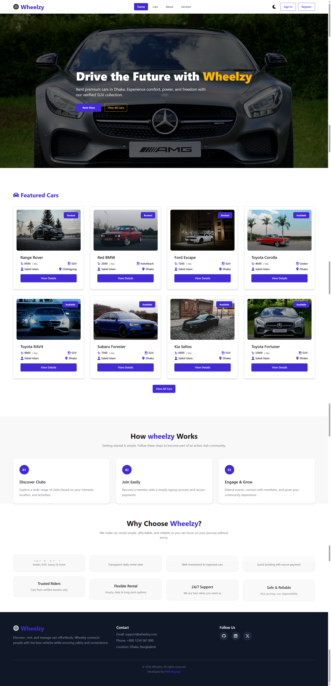

# Wheelzy Frontend

Wheelzy Frontend is the client-side application of the Wheelzy car rental platform. It provides a modern, responsive, and user-friendly interface for users, riders, and admins to browse cars, manage bookings, and handle payments.

## 🚀 Tech Stack

- React (Vite)
- React Router DOM
- TanStack React Query
- Axios
- Tailwind CSS
- DaisyUI
- Firebase Authentication
- SweetAlert2
- Stripe (Client-side)

## ✨ Features

### User

- Browse available cars
- View car details
- Book cars
- Secure online payments
- View booking history

### Rider

- Add and manage cars
- Track bookings
- View earnings

### Admin

- Manage users and cars
- Approve or reject cars
- Monitor platform activity

## 🔐 Environment Variables

Create a `.env` file in the root directory and add:

```
VITE_API_URL=http://localhost:5000
VITE_FIREBASE_API_KEY=your_key
VITE_FIREBASE_AUTH_DOMAIN=your_domain
VITE_FIREBASE_PROJECT_ID=your_project_id
VITE_FIREBASE_STORAGE_BUCKET=your_bucket
VITE_FIREBASE_MESSAGING_SENDER_ID=your_sender_id
VITE_FIREBASE_APP_ID=your_app_id
VITE_STRIPE_PUBLISHABLE_KEY=your_stripe_key
```

## ▶️ Run Locally

```bash
npm install
npm run dev
```

## 🌐 Deployment

You can deploy the frontend using:

- Vercel
- Netlify
- Firebase Hosting

Make sure to update environment variables in the deployment platform.

## 📌 Notes

- Backend must be running for full functionality
- Firebase project must match backend Firebase Admin SDK
- Stripe payments require valid keys

## 👤 Author

**Md. Fazle Rabbi Rayhan**

GitHub: https://github.com/MFRRayhan

Live Preview: https://wheelzy-e3805.web.app

---



© 2026 Wheelzy. All rights reserved.
